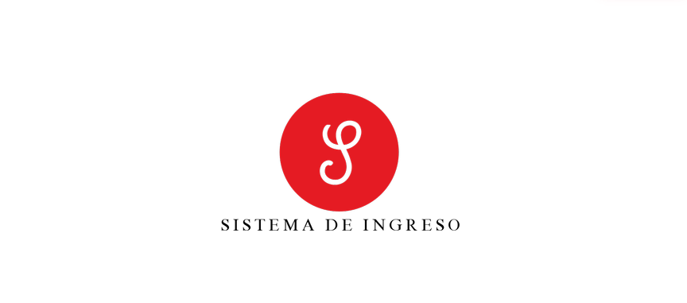

PROYECTO SISTEMAS DE INGRESO
 

OBJETIVO GENERAL

En primer lugar, se implementa un aplicativo que brinde seguridad al colegio Nuestra Señora De Fátima. El producto llegara a hacer que este proyecto sea implementado en la institución y con gran afinidad su elaboración realizara un buen servicio que es generar seguridad a los estudiantes, docente, coordinadores y el rector. 

OBJETIVOS ESPECÍFICOS

•	Implementar un sistema de información para el ingreso de la comunidad educativa.
•	Control de acceso para la comunidad educativa a través del sistema de información.
•	Crear un control de seguridad para garantizar la protección de los datos del usuario.

JUSTIFICACIÓN

Controlar el sistema de ingreso a la institución Nuestra Señora De Fátima de una manera óptima y organizada, permitiendo el control de los usuarios que ingresan. Usando sistemas de detección de huella dactilar, para que de este modo se pueda determinar quién entra, o quien intenta entrar, y determinar si está permitido su ingreso.

ALCANCE DEL PROYECTO

Organizar las entradas y salidas de una manera más rápida y con seguridad para toda la institución y por consiguiente a la comunidad educativa como lo son: Docentes, coordinadores, secretarios y estudiantes.
